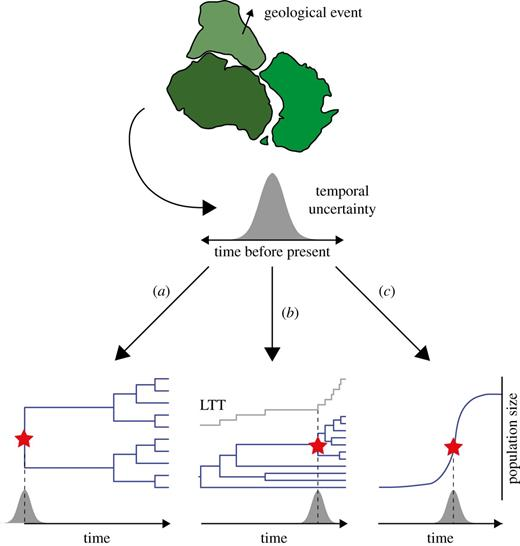

# Data and Analysis Pipeline for Molecular Clocks

A molecular clock analysis generally follows the same pipeline that starts with raw sequence data and finalizes with a time-scaled phylogenetic tree. 

## 1) Obtaining Sequences and Molecular Data

Of course, to get started we first have to obtain the homologous DNA/RNA/amino acid sequences sampled from different species, populations, or time points that we will be analyzing for sequence change and create a phylogenetic tree. Molecular clock analysis can use whole genomes, single genes, and concatenated loci, so whatever part of the genome we need to utilize we can use. We can obtain through our public DNA/RNA databases such as GenBank, ENA, and GISAID. We can also use the sequences we obtain from sequencing in our own labs, provided we ensure that they pass our respective quality control filtering. 

We also want to make sure that we have the relevant **metadata** that we will use later in our phylogenetic tree. This is composed mainly of elements that provide our sequences with more context, providing our sequences with information about the species it was obtained from, sampling location, and (arguably most importantly) sampling *date*. By utilizing the sampling date, BEAST can convert sequence changes to dates, and dates to years on our phylogenetic tree. 

Here in BEAST, import of tip dates (sampling dates for each sample) is crucial for the creation of the phylogeny in the next steps. 

Lastly, we want to ensure that the sequences that we use contain homologous regions across all samples. This way, in the next step (Multiple Sequence Alignment), the alignment of sequences will be successful and meaningful, and the creation of the phylogenetic tree later on will be accurate. 

## 2) Multiple Sequence Alignment

A crucial step in many data pipelines in bioinformatics tools, multiple sequence alignment (MSA) arranges sequences so that columns correspond to homologous sites and gaps represent insertions or deletions. In the molecular clock analysis pipeline, MSA is crucial as the phylogeny is derived from looking at substitution counts when looking at column-wise comparisons. Bad alignment can construe false substitutions or hide real substitutions, resulting in a biased creation of the phylogeny and clock fitting. 

Of course, there are a lot of common MSA tools that have been developed, and some have been specifically useful in alignment for the purpose of the creation of a phylogeny. These include tools like MAFFT, a widely used, fast, and accurate tool for nucleotide and protein sequences, and MUSCLE/MUSCLE5, a tool with high-accuracy alignments and tools to diagnose alignment uncertainty.

[Geneious Academy](https://www.geneious.com/guides/understanding-sequence-alignment)

## 3) Inference of Phylogenetic Tree

After MSA, we can now infer a phylogenetic tree under a substitution model which we will use to describe how nucleotides or amino acids change over time. Major computational frameworks for this step include: 

Maximum likelihood: finds tree and model parameters that maximize the likelihood of the observed alignment, used in tools like IQ-TREE, RAxML, PhyML

[Minh et. al 2020](https://pmc.ncbi.nlm.nih.gov/articles/PMC7182206) 

Bayesian inference: samples trees and parameters from the posterior distribution using Markov chain Monte Carlo (MCMC), tools include our primary program BEAST, MrBayes, RevBayes 

[Ho, Duchene 2014](https://onlinelibrary.wiley.com/doi/10.1111/mec.12953)

The output of this inference is a phylogenetic tree which has branch lengths corresponding to subsitutions per site, and in the next step we will place the clock model on this tree to convert substituions per site into units of time. 

## 4) Selection and Placement of Molecular Clock Model

Once the substitution tree is created, a clock model is place onto the tree to convert substitutions per site into time units. However, to do this, we must perform calibration using a time constraint in order to position the times/years we obtain into actual real time, or else all we have are relative ages. 

[Ho et. al 2015](https://royalsocietypublishing.org/rsbl/article/11/9/20150194/34621/Biogeographic-calibrations-for-the-molecular) 

Common calibration strategies include: fossil calibrations, which construct node ages from fossil ages using min/max bounds or probablistic priors (lognormal, uniform, etc.); biogeographic/historical calibrations, which construct timing constraints from known geographic/historical events (continental drift, island colonizations); tip dating and heterochronous sampling, which uses sampling dates of sequences that act as calibrations directly on the tips, allowing simultaneous estimation of rates and times. 

Once calibrated, we use frameworks like BEAST to place our choice of clock onto the phylogeny to produce date estimates as well as check model fit using analysis from our statistical inferences (Bayesian inferences, posterior/prior predictive checks) of choice in order to verify the model fit is ideal. 

[Drummond et. al 2006](https://journals.plos.org/plosbiology/article?id=10.1371%2Fjournal.pbio.0040088) 

## 5) Final Output: Time-Scaled, Ultrametic Phylogenic Tree

Our final product is usually an ultrametric, time-scaled phylogenetic tree. All tips align either at present time or at their respective uniform sampling time. The x-axis should be in units of absolute time (years or some magnitude of years).

From these trees, we can read off many important pieces of data and information (some examples we will cover in depth in the next section). Common use cases include: 

*Time to most recent common ancestor (tMRCA)*: Analyzing where particular clades or branches originate, such as detecting the origin of the lineage of a virus, or finding out where humans divereged from chimpanzees. 

*Speed and method of diversification*: Similar to tMRCA, determined by comparing branching patterns and branch ages across clades 

*Comparison of divergence times to historical reccords*: Utilizing the model's estimated divergence times to previous understandings and records of events (fossil records, geological events, historical data) 

